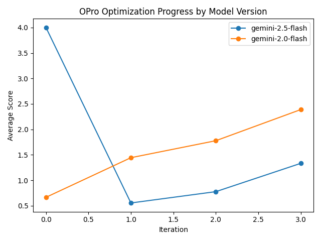

# 📚 EduPrompt-OPro: Optimized Prompt Engineering for Educational Chatbots

This project explores **prompt optimization** using [Open-ended Prompt Optimization (OPro)](https://arxiv.org/abs/2309.03409), applied to **educational chatbot tasks** such as tutoring, exam question answering, and personalized explanation. We leverage **Gemini**, **Claude**, and optionally **GPT models** to generate, evaluate, and refine prompts that maximize task-specific utility.

## 🔍 What This Project Does

- ✅ Implements the OPro framework for prompt optimization
- 🤖 Uses LLMs (Gemini, Claude, GPT) as both **scorers** and **generators**
- 🎯 Focuses on education-specific use cases (e.g., grammar correction, concept explanation)
- 📊 Evaluates prompt quality with both **automatic metrics** and **LLM-based evaluations**
- 🌐 (Optional) Provides a simple web interface for demo and human-in-the-loop tuning

---

## 🧠 Why OPro?

> OPro frames prompt optimization as a **black-box search** problem, where candidate prompts are evaluated by scoring models and iteratively improved using techniques like self-rewarding, bootstrapping, or gradient-free search.

This project adapts that idea to practical prompt engineering for chatbots in domains like:

- Language learning
- Math tutoring
- Study guide generation
- Answer verification

---

## 🚀 Quick Start

### 1. Clone the Repo

```bash

git clone https://github.com/YubinGitHubProfile/edu-chatbot-opro.git
cd edu-chatbot-opro
```

### 2. Example Usage

To run prompt optimization from the command line using the CLI:

```bash
# For Gemini 2.5 Flash (default)
python cli.py --prompt-type chatbot --model-version gemini-2.5-flash --num-iterations 5 --candidates-per-iter 4 --temperature 0.6 --api-key YOUR_GEMINI_API_KEY

# For Gemini 2.0 Flash
python cli.py --prompt-type chatbot --model-version gemini-2.0-flash --num-iterations 5 --candidates-per-iter 4 --temperature 0.6 --api-key YOUR_GEMINI_API_KEY
```

Replace `YOUR_GEMINI_API_KEY` with your actual Gemini API key, or set it in a `.env` file as `GEMINI_API_KEY`.

You can also omit arguments to use the defaults from `config.py` and `base_prompts.json`:

```bash
python cli.py
```

This will optimize the selected prompt type using the OPro engine and print the best prompt found. Use the `--model-version` flag to switch between Gemini 2.0 Flash and 2.5 Flash.

